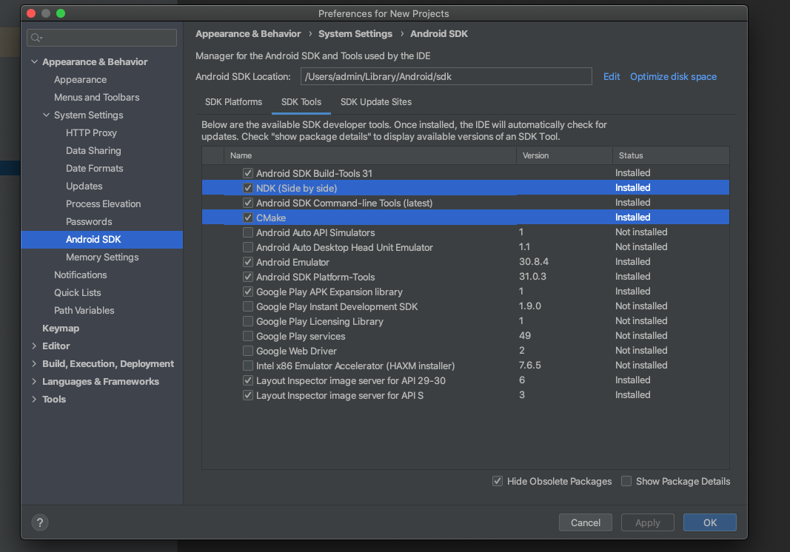
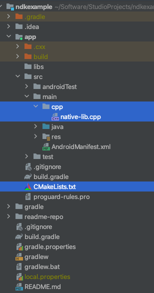
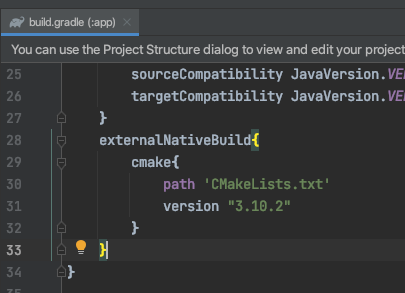
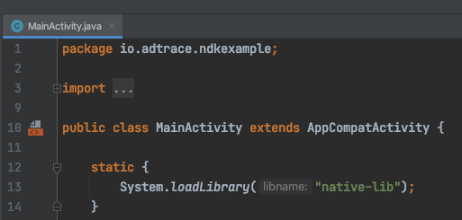
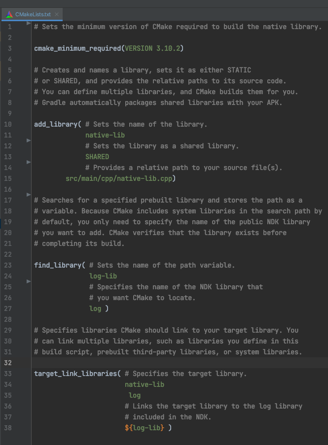
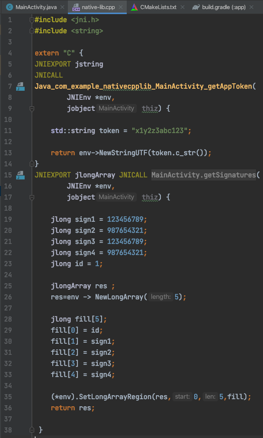

<p align="center"><a href="https://adtrace.io" target="_blank" rel="noopener noreferrer"></a><a href="https://adtrace.io" target="_blank" rel="noopener noreferrer"></a> </p>  
<p align="center">  
  <a href='https://opensource.org/licenses/MIT'></a>  
</p> 


# Hiding AppToken and SDK Signatures in Android using NDK

As the most important parts of Adtrace SDK implementation for applications, `appToken` and `SDK signatures` must be carefully taken care of. it's not that hard to extract any key from an APK using reverse engineering. however accessing Adtrace `apptoken` or `SDK signatures` does not have anything to do with hacking our SDK, because we use **robust algorithms** to validate every request and **guarantee** that it is coming from your application and not anywhere else.

## Table of contents
* [Introduction]
* [Download the NDK and build tools]
    * [The Android Development Kit]
    * [CMake]
    * [LLDB]
* [Create new C/C++ source file]
* [Configure CMake]
* [Add NDK APIs]
* [Simple C++ code using JNI]


### <a id="qs-intro"></a>Introduction

One of the safest ways to hide this sensitive data is [Using NDK to add C and C++ code to your android project](https://developer.android.com/studio/projects/add-native-code). all secret information will be stored in C++ file and backed inside `.so` file. it's extremely hard to extract string from a `.so` file because C file is converted to machine code. if anyone anyhow is able to extract the information from `.so` file the secret text will be in hex value which is not readable and `SDK signatures` are even harder to be found because of their numeral characteristics.

### <a id="qs-downloadndk-and-buildtools"></a>Download the NDK and build tools


#### <a id="qs-downloadndk-and-buildtools"></a> Download the NDK and build tools
NDK  is a toolset that allows you to use C and C++ code with Android, and provides platform libraries that allow you to manage native activities and access physical device components, such as sensors and touch input.

#### <a id="qs-cmake"></a> CMake
an external build tool that works alongside Gradle to build your native library. You do not need this component if you only plan to use ndk-build.
<p align="start"> </p>  


#### <a id="qs-lldb"></a> LLDB
the debugger Android Studio uses to [debug native code](https://developer.android.com/studio/debug). you can read more details about how to install and config in [here](https://developer.android.com/studio/projects/install-ndk).

### <a id="qs-create-c-cpp-source-file"></a>Create new C/C++ source file
To add new `C/C++` source files to an existing project, proceed as follows:

1. If you don't already have a `cpp/` directory in the main source set of your app, create one as follows:
   a. Open the **Project** pane from the left side of the IDE and select the **Project** view from the drop-down menu.
   b. Navigate to **your-module > src**, right-click on the **main** directory, and select **New > Directory**.
   c. Enter `cpp` as the directory name and click **OK**.
2. Right-click on the `cpp/` directory and select **New > C/C++ Source File**.
3. Enter a name for your source file, such as `native-lib`.
4. From the **Type** drop-down menu, select the file extension for your source file, such as `.cpp`.
- You can add other file types to the drop-down menu, such as `.cxx` or `.hxx`, by clicking **Edit File Types** . In the **C/C++** dialog box that pops up, select another file extension from the **Source Extension** and **Header Extension** drop-down menus and click **OK**.
5. If you also want to create a header file, check the **Create an associated header** checkbox.
6. Click **OK**.


### <a id="qs-configure-cmake"></a>Configure CMake
A CMake build script is a plain text file that you must name `CMakeLists.txt` and includes commands CMake uses to build your C/C++ libraries. If your native sources don't already have a CMake build script, **you need to create one yourself** and include the appropriate CMake commands.

<p align="start"> </p>  
<p align="start"> </p> 
 To learn how to install CMake, see [Download the NDK and build tools].
You can now configure your build script by adding CMake commands. To instruct CMake to create a native library from native source code, add the `cmake_minimum_required()` and `add_library()` commands to your build script:

```
# Sets the minimum version of CMake required to build your native library.
# This ensures that a certain set of CMake features is available to
# your build.

cmake_minimum_required(VERSION 3.4.1)

# Specifies a library name, specifies whether the library is STATIC or
# SHARED, and provides relative paths to the source code. You can
# define multiple libraries by adding multiple add_library() commands,
# and CMake builds them for you. When you build your app, Gradle
# automatically packages shared libraries with your APK.

add_library( # Specifies the name of the library.
             native-lib

             # Sets the library as a shared library.
             SHARED

             # Provides a relative path to your source file(s).
             src/main/cpp/native-lib.cpp )
```
When you add a source file or library to your CMake build script using `add_library()`, Android Studio also shows associated header files in the **Project** view after you sync your project. However, in order for CMake to locate your header files during compile time, you need to add the `include_directories()` command to your CMake build script and specify the path to your headers:
```
add_library(...)

# Specifies a path to native header files.
include_directories(src/main/cpp/include/)
```

The convention CMake uses to name the file of your library is as follows:

<code>lib<strong>library-name</strong>.os</code>

For example, if you specify `"native-lib"` as the name of your shared library in the build script, CMake creates a file named `libnative-lib.so`. However, when loading this library in your Java or Kotlin code, use the name you specified in the CMake build script:

#### Groovy
```java
static  {  
  System.loadLibrary("native-lib");  
}
```

#### Kotlin
```kotlin
companion object  {  
  init  {  
  System.loadLibrary("native-lib");  
  }  
}
```
<p align="start"> </p> 

**Note:** If you rename or remove a library in your CMake build script, you need to clean your project before Gradle applies the changes or removes the older version of the library from your APK. To clean your project, select **Build > Clean Project** from the menu bar.

Android Studio automatically adds the source files and headers to the **cpp** group in the **Project** pane. By using multiple `add_library()` commands, you can define additional libraries for CMake to build from other source files.


### <a id="qs-add-ndk-apis"></a>Add NDK APIs

Add the `find_library()` command to your CMake build script to locate an NDK library and store its path as a variable. You use this variable to refer to the NDK library in other parts of the build script. The following sample locates the [Android-specific log support library](https://developer.android.com/ndk/guides/stable_apis#a3) and stores its path in `log-lib`:
```
find_library( # Defines the name of the path variable that stores the
              # location of the NDK library.
              log-lib

              # Specifies the name of the NDK library that
              # CMake needs to locate.
              log )
```
In order for your native library to call functions in the `log` library, you need to link the libraries using the `target_link_libraries()`command in your CMake build script:
```
find_library(...)

# Links your native library against one or more other native libraries.
target_link_libraries( # Specifies the target library.
                       native-lib

                       # Links the log library to the target library.
                       ${log-lib} )
```

<p align="start"> </p>  

### <a id="qs-cpp-jni"></a> Simple C++ code using JNI
in order to receive information from native code you have to `include` JNI inside C++ file(`native-lib`).
```cpp
#include <jni.h>
```
since `appToken` is String you need to add `string` class too.
```cpp
#include <string>
```
now `appToken` value can be hard coded and passed to classes that `loadLibrary` method is [implemented in](#qs-configure-cmake ). this will allow you to load the library you created in C++ and of course the information you need to obtain from it.
an **example** of returning `appToken` from `native-lib.cpp` to `MainActivity.java` :
```cpp
JNIEXPORT jstring JNICALL  
Java_com_example_nativecpplib_MainActivity_getAppToken(  
        JNIEnv *env,  
  jobject thiz) {  
    std::string token = "x1y2z3abc123";  
  
 return env->NewStringUTF(token.c_str());  
}
```
by which method name mean:

|part|reference|
|--|--|
|`Java`|Language|
|`com_example_nativecpplib`|package name|
|`MainActivity`|class name|
|`getAppToken`|native method used in class|
and  `Java` method would obtain value to be used in any parts of code. for `appToken` it is like:
```java
public native String getAppToken();
//method body does not exists in java code in MainActivity
/*
...
*/
String appToken = getAppToken();
String environment = AdTraceConfig.ENVIRONMENT_SANDBOX;
AdTraceConfig config = new AdTraceConfig(this, appToken, environment);
AdTrace.onCreate(config);
```
you can repeat this process for `SDK signatures` too afterwards:
```cpp
JNIEXPORT jlongArray JNICALL
Java_com_example_nativecpplib_MainActivity_getSignatures(  
        JNIEnv *env,  
  jobject thiz) {  
  
  jlong sign1 = 123456789;  
  jlong sign2 = 987654321;  
  jlong sign3 = 123456789;  
  jlong sign4 = 987654321;  
  jlong id = 1;  
  jlongArray res ;  
  res=env -> NewLongArray(5);  
  jlong fill[5];  
  fill[0] = id;  
  fill[1] = sign1;  
  fill[2] = sign2;  
  fill[3] = sign3;  
  fill[4] = sign4;  
  (*env).SetLongArrayRegion(res,0,5,fill);  
  return res;  
  }
```
and:

```java
public native long[] getSignatures();
//method body does not exists in java code in MainActivity
/*
...
*/
AdTraceConfig config = new AdTraceConfig(this, appToken, environment);

long[] sdkSignatures = getSignatures();

sdkSignatures[1];
config.setAppSecret(
  sdkSignatures[0], //secretId
  sdkSignatures[1], //info1
  sdkSignatures[2], //info2
  sdkSignatures[3], //info3
  sdkSignatures[4]  //info4
  );

AdTrace.onCreate(config);

```

<p align="start"> </p>  


[Introduction]: #qs-intro
[Download the NDK and build tools]: #qs-downloadndk-and-buildtools
[The Android Development Kit]: #qs-android-development-kit
[CMake]: #qs-cmake
[LLDB]: #qs-lldb
[Create new C/C++ source file]: #qs-create-c-cpp-source-file
[Configure CMake]: #qs-configure-cmake
[Add NDK APIs]: #qs-add-ndk-apis
[Simple C++ code using JNI]: #qs-cpp-jni
